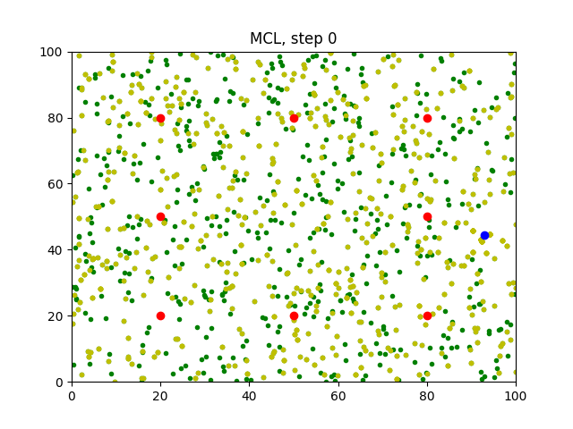
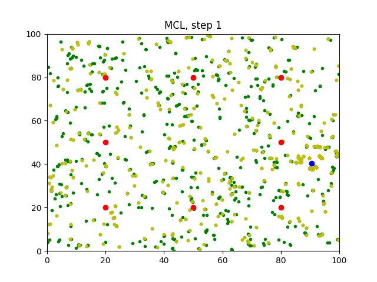
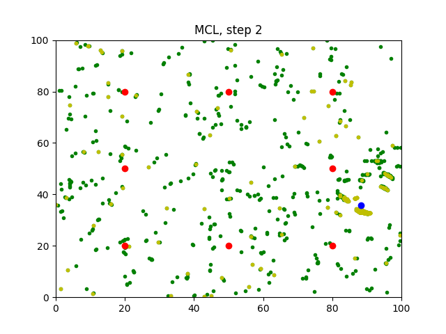
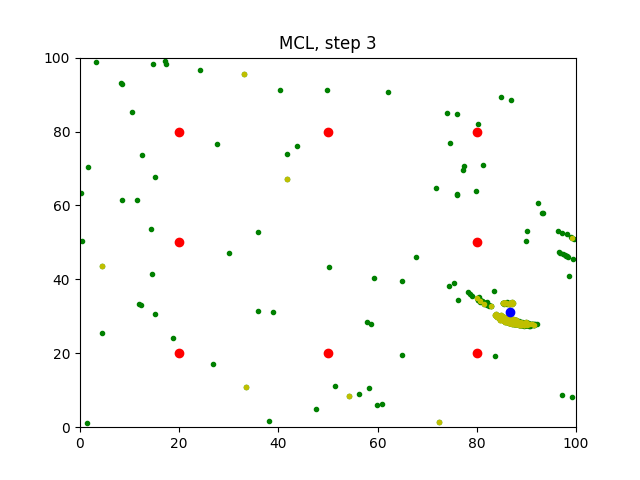
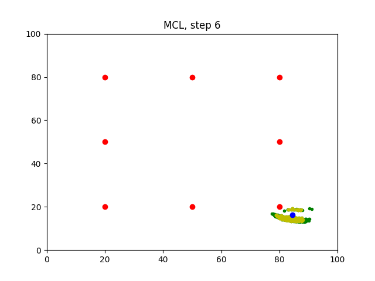
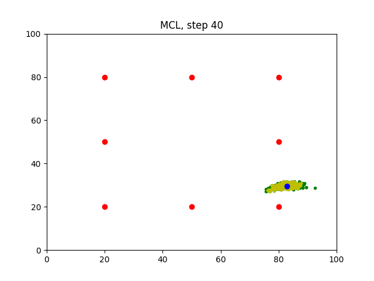

[Monte_Carlo_Localization]

# Monte_Carlo_Localization
You will be able to observe the `MCL` in action through the generated images. 

### Editing the Program
Enter the code in the designated section:
```C++
//####   DON'T MODIFY ANYTHING ABOVE HERE! ENTER CODE BELOW ####
		
//TODO: Graph the position of the robot and the particles at each step 
```

### Compiling the Program
```sh
$ rm -rf Images/*
$ g++ solution.cpp -o app -std=c++11 -I/usr/include/python3.8 -lpython3.8 -g -Wall -fno-omit-frame-pointer
```

### Running the Program
Before you run the program, make sure the `Images` folder is empty!
```sh
$ ./app
```
Wait for the program to iterate `50` times.

### Generated Images
After running the program, `50` images will be generated in the `Images` folder.
#### Step0

#### Step1

#### Step2

#### Step3

#### Step4

#### Step5

#### Step6

#### Step7

#### Step8

#### Step10

#### Step12

#### Step14

#### Step18

#### Step20

#### Step30

#### Step40

#### Step49


