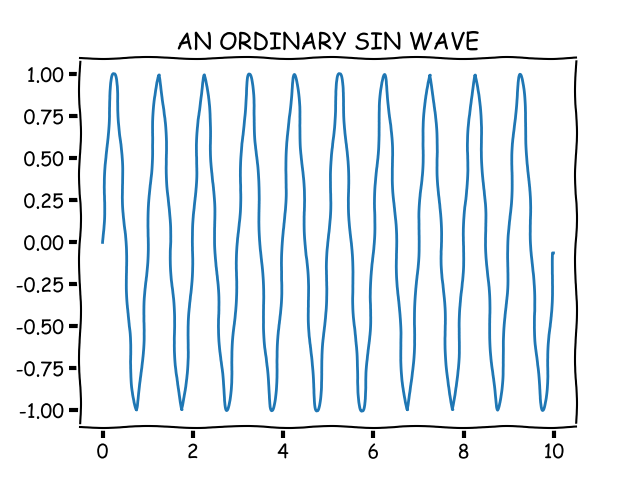
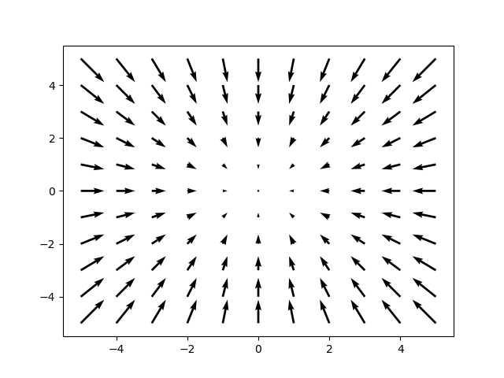
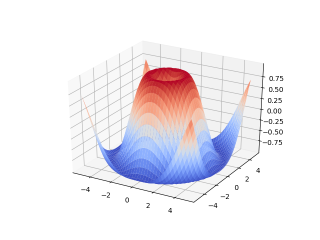

matplotlib-cpp
==============

Welcome to matplotlib-cpp, possibly the simplest C++ plotting library.
It is built to resemble the plotting API used by Matlab and matplotlib.

https://github.com/lava/matplotlib-cpp?login=from_csdn

Usage
-----
Complete minimal example:
```cpp
#include "matplotlibcpp.h"
namespace plt = matplotlibcpp;
int main() {
    plt::plot({1,3,2,4});
    plt::show();
}
```
    g++ minimal.cpp -std=c++11 -I/usr/include/python2.7 -lpython2.7

**Result:**


A more comprehensive example:
```cpp
#include "matplotlibcpp.h"
#include <cmath>

namespace plt = matplotlibcpp;

int main()
{
    // Prepare data.
    int n = 5000;
    std::vector<double> x(n), y(n), z(n), w(n,2);
    for(int i=0; i<n; ++i) {
        x.at(i) = i*i;
        y.at(i) = sin(2*M_PI*i/360.0);
        z.at(i) = log(i);
    }

    // Set the size of output image to 1200x780 pixels
    plt::figure_size(1200, 780);
    // Plot line from given x and y data. Color is selected automatically.
    plt::plot(x, y);
    // Plot a red dashed line from given x and y data.
    plt::plot(x, w,"r--");
    // Plot a line whose name will show up as "log(x)" in the legend.
    plt::named_plot("log(x)", x, z);
    // Set x-axis to interval [0,1000000]
    plt::xlim(0, 1000*1000);
    // Add graph title
    plt::title("Sample figure");
    // Enable legend.
    plt::legend();
    // Save the image (file format is determined by the extension)
    plt::save("./basic.png");
}
```
    g++ basic.cpp -I/usr/include/python2.7 -lpython2.7

**Result:**


Alternatively, matplotlib-cpp also supports some C++11-powered syntactic sugar:
```cpp
#include <cmath>
#include "matplotlibcpp.h"

using namespace std;
namespace plt = matplotlibcpp;

int main()
{
    // Prepare data.
    int n = 5000; // number of data points
    vector<double> x(n),y(n);
    for(int i=0; i<n; ++i) {
        double t = 2*M_PI*i/n;
        x.at(i) = 16*sin(t)*sin(t)*sin(t);
        y.at(i) = 13*cos(t) - 5*cos(2*t) - 2*cos(3*t) - cos(4*t);
    }

    // plot() takes an arbitrary number of (x,y,format)-triples.
    // x must be iterable (that is, anything providing begin(x) and end(x)),
    // y must either be callable (providing operator() const) or iterable.
    plt::plot(x, y, "r-", x, [](double d) { return 12.5+abs(sin(d)); }, "k-");


    // show plots
    plt::show();
}
```
    g++ modern.cpp -std=c++11 -I/usr/include/python2.7 -lpython

**Result:**


Or some *funny-looking xkcd-styled* example:
```cpp
#include "matplotlibcpp.h"
#include <vector>
#include <cmath>

namespace plt = matplotlibcpp;

int main() {
    std::vector<double> t(1000);
    std::vector<double> x(t.size());

    for(size_t i = 0; i < t.size(); i++) {
        t[i] = i / 100.0;
        x[i] = sin(2.0 * M_PI * 1.0 * t[i]);
    }

    plt::xkcd();
    plt::plot(t, x);
    plt::title("AN ORDINARY SIN WAVE");
    plt::save("xkcd.png");
}

```
    g++ xkcd.cpp -std=c++11 -I/usr/include/python2.7 -lpython2.7

**Result:**



When working with vector fields, you might be interested in quiver plots:
```cpp
#include "../matplotlibcpp.h"

namespace plt = matplotlibcpp;

int main()
{
    // u and v are respectively the x and y components of the arrows we're plotting
    std::vector<int> x, y, u, v;
    for (int i = -5; i <= 5; i++) {
        for (int j = -5; j <= 5; j++) {
            x.push_back(i);
            u.push_back(-i);
            y.push_back(j);
            v.push_back(-j);
        }
    }

    plt::quiver(x, y, u, v);
    plt::show();
}
```
    g++ quiver.cpp -std=c++11 -I/usr/include/python2.7 -lpython2.7

**Result:**



When working with 3d functions, you might be interested in 3d plots:
```cpp
#include "../matplotlibcpp.h"

namespace plt = matplotlibcpp;

int main()
{
    std::vector<std::vector<double>> x, y, z;
    for (double i = -5; i <= 5;  i += 0.25) {
        std::vector<double> x_row, y_row, z_row;
        for (double j = -5; j <= 5; j += 0.25) {
            x_row.push_back(i);
            y_row.push_back(j);
            z_row.push_back(::std::sin(::std::hypot(i, j)));
        }
        x.push_back(x_row);
        y.push_back(y_row);
        z.push_back(z_row);
    }

    plt::plot_surface(x, y, z);
    plt::show();
}
```

**Result:**



Installation
------------

matplotlib-cpp works by wrapping the popular python plotting library matplotlib. (matplotlib.org)
This means you have to have a working python installation, including development headers.
On Ubuntu:

    sudo apt-get install python-matplotlib python-numpy python2.7-dev

If, for some reason, you're unable to get a working installation of numpy on your system,
you can define the macro `WITHOUT_NUMPY` before including the header file to erase this
dependency.

The C++-part of the library consists of the single header file `matplotlibcpp.h` which
can be placed anywhere.

Since a python interpreter is opened internally, it is necessary to link
against `libpython` in order to user matplotlib-cpp. Most versions should
work, although python likes to randomly break compatibility from time to time
so some caution is advised when using the bleeding edge.


# CMake

The C++ code is compatible to both python2 and python3. However, the `CMakeLists.txt`
file is currently set up to use python3 by default, so if python2 is required this
has to be changed manually. (a PR that adds a cmake option for this would be highly
welcomed)

**NOTE**: By design (of python), only a single python interpreter can be created per
process. When using this library, *no other* library that is spawning a python
interpreter internally can be used.

To compile the code without using cmake, the compiler invocation should look like
this:

    g++ example.cpp -I/usr/include/python2.7 -lpython2.7

This can also be used for linking against a custom build of python

    g++ example.cpp -I/usr/local/include/fancy-python4 -L/usr/local/lib -lfancy-python4

# Vcpkg

You can download and install matplotlib-cpp using the [vcpkg](https://github.com/Microsoft/vcpkg) dependency manager:

    git clone https://github.com/Microsoft/vcpkg.git
    cd vcpkg
    ./bootstrap-vcpkg.sh
    ./vcpkg integrate install
    vcpkg install matplotlib-cpp
  
The matplotlib-cpp port in vcpkg is kept up to date by Microsoft team members and community contributors. If the version is out of date, please [create an issue or pull request](https://github.com/Microsoft/vcpkg) on the vcpkg repository.


# C++11

Currently, c++11 is required to build matplotlib-cpp. The last working commit that did
not have this requirement was `717e98e752260245407c5329846f5d62605eff08`.

Note that support for c++98 was dropped more or less accidentally, so if you have to work
with an ancient compiler and still want to enjoy the latest additional features, I'd
probably merge a PR that restores support.


Why?
----
I initially started this library during my diploma thesis. The usual approach of
writing data from the c++ algorithm to a file and afterwards parsing and plotting
it in python using matplotlib proved insufficient: Keeping the algorithm
and plotting code in sync requires a lot of effort when the C++ code frequently and substantially
changes. Additionally, the python yaml parser was not able to cope with files that
exceed a few hundred megabytes in size.

Therefore, I was looking for a C++ plotting library that was extremely easy to use
and to add into an existing codebase, preferably header-only. When I found
none, I decided to write one myself, which is basically a C++ wrapper around
matplotlib. As you can see from the above examples, plotting data and saving it
to an image file can be done as few as two lines of code.

The general approach of providing a simple C++ API for utilizing python code
was later generalized and extracted into a separate, more powerful
library in another project of mine, [wrappy](http://www.github.com/lava/wrappy).


Todo/Issues/Wishlist
--------------------
* This library is not thread safe. Protect all concurrent access with a mutex.
  Sadly, this is not easy to fix since it is not caused by the library itself but
  by the python interpreter, which is itself not thread-safe.

* It would be nice to have a more object-oriented design with a Plot class which would allow
  multiple independent plots per program.

* Right now, only a small subset of matplotlibs functionality is exposed. Stuff like xlabel()/ylabel() etc. should
  be easy to add.

* If you use Anaconda on Windows, you might need to set PYTHONHOME to Anaconda home directory and QT_QPA_PLATFORM_PLUGIN_PATH to %PYTHONHOME%Library/plugins/platforms. The latter is for especially when you get the error which says 'This application failed to start because it could not find or load the Qt platform plugin "windows"
in "".'

* MacOS: `Unable to import matplotlib.pyplot`. Cause: In mac os image rendering back end of matplotlib (what-is-a-backend to render using the API of Cocoa by default). There is Qt4Agg and GTKAgg and as a back-end is not the default. Set the back end of macosx that is differ compare with other windows or linux os.
Solution is described [here](https://stackoverflow.com/questions/21784641/installation-issue-with-matplotlib-python?noredirect=1&lq=1), additional information can be found there too(see links in answers).
